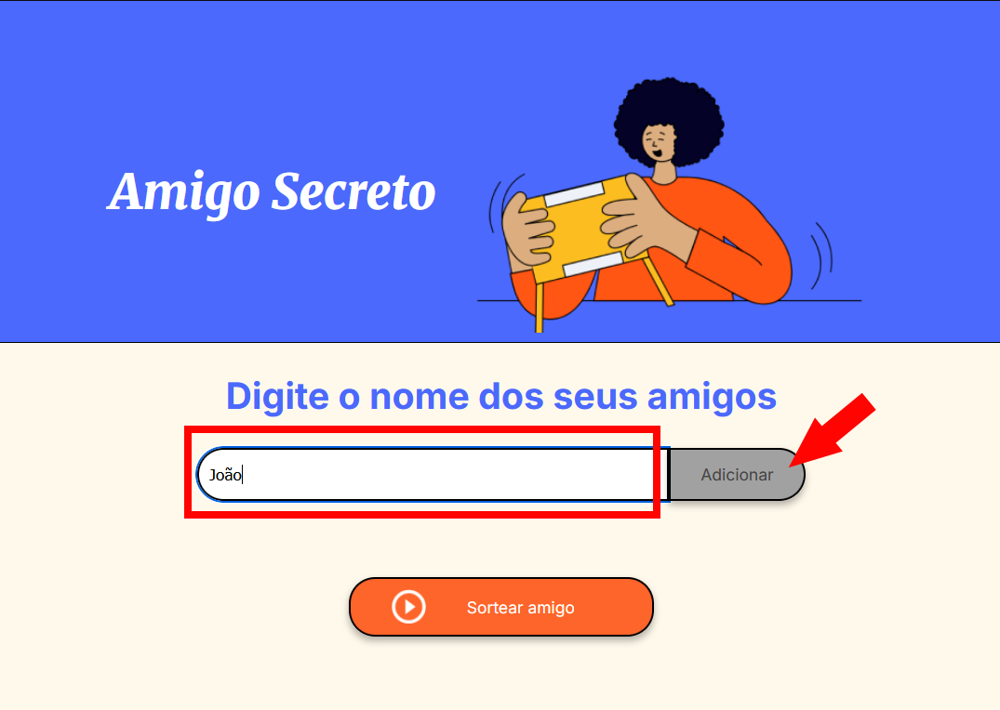
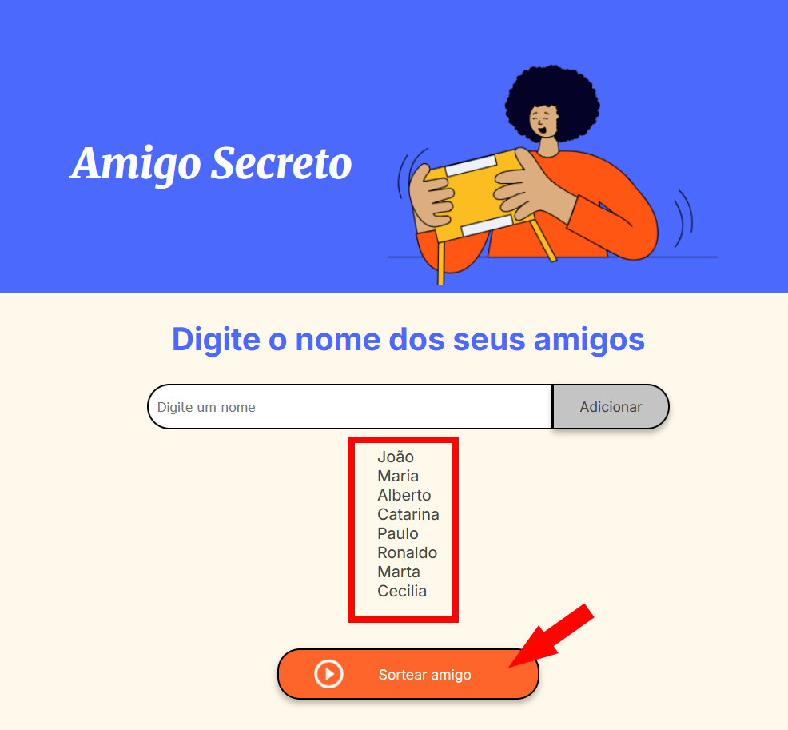

# Challenge - Amigo Secreto

## Descrição do projeto em PT-BR
Este repositório contém a minha versão do *challenge* "Amigo Secreto", feito como parte do programa ONE da Oracle em parceiria com a Alura.

### Como utilizar o projeto
- Acesse [este link](https://mathgoodend.github.io/challenge_amigo_secreto/) para ir até o site onde o projeto está hospedado;
- Digite um nome na caixa "Digite um nome" e clique no botão "Adicionar", conforme a imagem a seguir, para adicionar quantos amigos quiser a lista do amigo secreto;
- 
- Após inserir os nomes que quiser, clique no botão "Sortear amigo", conforme a imagem a seguir;
- 
- Um nome será sorteado cada vez que clicar no botão e será exibido em verde, conforme a imagem;
- 
- Para preencher uma nova lista e sortear outros nomes, recarregue a página ou pressione `F5`;

## Description in EN
This repository contains my version of the challenge "Amigo Secreto" (*Secret Santa*), done as part of the ONE program by Oracle in partnership with Alura

### How to test this project
- Access [this link](https://mathgoodend.github.io/challenge_amigo_secreto/) to go to the webpage hosting this project;
- Type a name on the box "Digite um nome" and click on the button "Adicionar", as shown in the image, to add how many friends you want to the secret santa list;
- 
- After inserting the names on the list, click on the button "Sortear amigo", as shown in the image;
- 
- A name will randomly selected each time you press the button and will be shown in green, like in the image below;
- 
- To fill a new list and select new names, refresh the page or press `F5`;