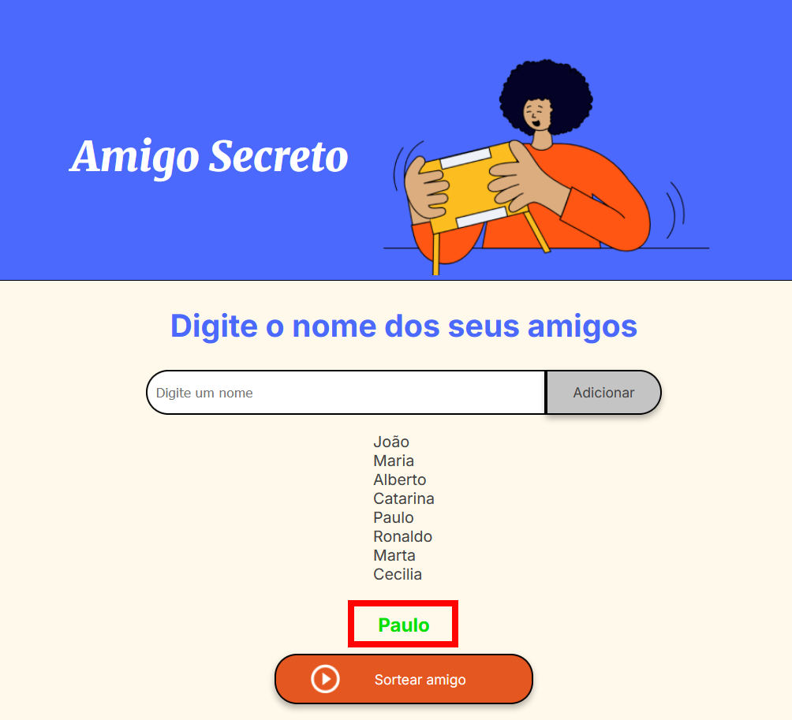

# Challenge - Amigo Secreto

## Descrição do projeto em PT-BR
Este repositório contém a minha versão do *challenge* "Amigo Secreto", feito como parte do programa ONE da Oracle em parceiria com a Alura.

### Como utilizar o projeto
- Acesse [este link](https://mathgoodend.github.io/challenge_amigo_secreto/) para ir até o site onde o projeto está hospedado;
- Digite um nome na caixa "Digite um nome" e clique no botão "Adicionar", conforme a imagem a seguir, para adicionar quantos amigos quiser a lista do amigo secreto;

- Após inserir os nomes que quiser, clique no botão "Sortear amigo", conforme a imagem a seguir;

- Um nome será sorteado cada vez que clicar no botão e será exibido em verde, conforme a imagem;

- Para preencher uma nova lista e sortear outros nomes, recarregue a página ou pressione `F5`;

### Funções implementadas
- `adicionarAmigo()`
  - Cria uma constante com o elemento HTML de id "amigo"
  - Valida se o valor do elemento "amigo", uma string, tem tamanho igual a `0` ou se é vazia após remover os espaços em branco
  - Caso não passe na validação é emitido um alerta
  - Caso passe na validação o nome é incluido na lista e o valor de "amigo" é zerado
  - Ao final é acionada a função `atualizarListaAmigos()`
- `atualizarListaAmigos()`
  - Cria uma constante com o elemento HTML de id "listaAmigos"
  - Cria uma constante com um novo elemento HTML do tipo "li"
  - Limpa o conteudo HTML do elemento "lista"
  - Inicia um loop onde os nomes dentro do array "lista" são atribuidos ao conteudo HTML de "li" e o elemento é então acresentado como filho do elemento "lista"
- `sortearNumero(num)`
  - A função recebe como argumento o valor máximo a ser sorteado
  - Ela retorna um valor entre `0` e `num - 1`
- `sortearAmigo()`
  - Cria uma constante com o elemento HTML de id "resultado"
  - Cria uma constante com um novo elemento HTML do tipo "li"
  - Limpa o conteudo HTML do elemento "resultado"
  - Valida se a lista possui apenas um item. Caso positivo retorna o primeiro item
  - Valida se a lista de nomes está vazia, emitindo um alerta caso esteja
  - Se o tamanho da lista de nomes for maior que 1 atribui ao conteudo HTML do "li" um item do array "amigos" cujo indice é sorteado pela função `sortearNumero()` que recebe como parâmetro o tamanho do array
  - Acrescenta o elemento "li" ao elemento "resultado"

## Description in EN
This repository contains my version of the challenge "Amigo Secreto" (*Secret Santa*), done as part of the ONE program by Oracle in partnership with Alura

### How to test this project
- Access [this link](https://mathgoodend.github.io/challenge_amigo_secreto/) to go to the webpage hosting this project;
- Type a name on the box "Digite um nome" and click on the button "Adicionar", as shown in the image, to add how many friends you want to the secret santa list;

- After inserting the names on the list, click on the button "Sortear amigo", as shown in the image;

- A name will randomly selected each time you press the button and will be shown in green, like in the image below;

- To fill a new list and select new names, refresh the page or press `F5`;

### How the functions where implemented
- `adicionarAmigo()`
  - Creates a constant with the HTML element with the id "amigo"
  - Validates whether the value of the "amigo" element, a string, has a length of `0` or is empty after removing whitespaces
  - If it does not pass validation, an alert is triggered
  - If it passes validation, the name is added to the list and the value of "amigo" is reset
  - At the end, the function `atualizarListaAmigos()` is called

- `atualizarListaAmigos()`
  - Creates a constant with the HTML element with the id "listaAmigos"
  - Creates a constant with a new HTML element of type "li"
  - Clears the HTML content of the "lista" element
  - Starts a loop where the names inside the "lista" array are assigned to the HTML content of "li", and the element is then appended as a child of the "lista" element

- `sortearNumero(num)`
  - The function receives the argument `num`, which is the maximum value to be drawn
  - It returns a value between `0` and `num - 1`

- `sortearAmigo()`
  - Creates a constant with the HTML element with the id "resultado"
  - Creates a constant with a new HTML element of type "li"
  - Clears the HTML content of the "resultado" element
  - Validates whether the list contains only one item. If so, it returns the first item
  - Checks if the list of names is empty, triggering an alert if it is
  - If the list has more than one name, assigns to the HTML content of "li" an item from the "amigos" array, whose index is randomly selected by the `sortearNumero()` function, which receives the array length as a parameter
  - Appends the "li" element to the "resultado" element
